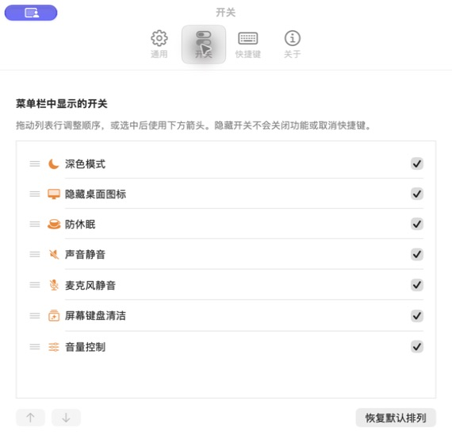
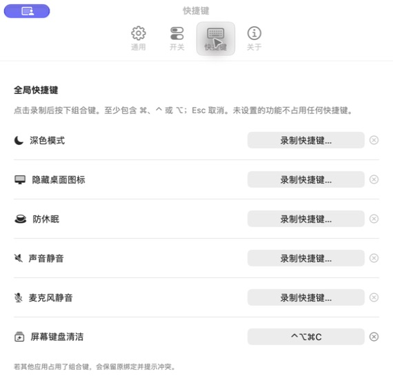
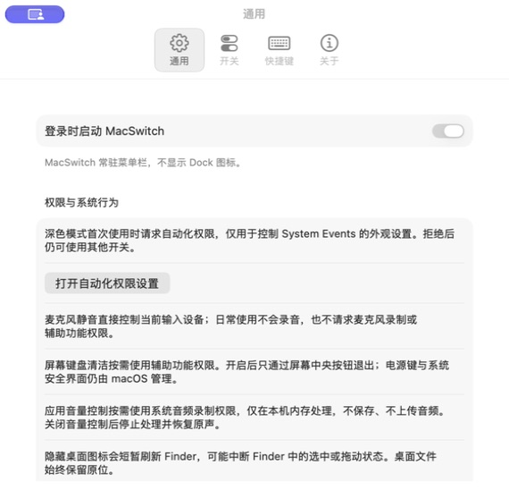

# MacSwitch

原生 macOS 菜单栏工具，把常用系统开关、屏幕键盘清洁和应用音量控制放在一起。使用 Swift 6 / SwiftUI，无第三方运行依赖、账号或联网服务，采用 [MIT 许可证](LICENSE)。

[下载最新版本](https://github.com/herman0216-glitch/MacSwitch/releases/latest) · [报告问题](https://github.com/herman0216-glitch/MacSwitch/issues) · [更新记录](CHANGELOG.md)

**系统要求：macOS 26.0 或更新版本。** Release 提供 Apple Silicon / Intel 通用应用；实机验证以 Apple Silicon 为主，Intel 尚未取得实机验证。界面目前为简体中文。

## 下载、安装与首次启动

1. 从 [GitHub Releases](https://github.com/herman0216-glitch/MacSwitch/releases/latest) 下载 `MacSwitch-版本号-universal.dmg`，打开后将 **MacSwitch.app** 拖到 **Applications（应用程序）**。也可以下载 ZIP，解压后将应用移入“应用程序”。GitHub 自动生成的 Source code 是源码，不是可运行应用。
2. 从“应用程序”双击 MacSwitch，点击菜单栏双开关图标使用。应用不显示 Dock 图标；已运行时再次打开会显示设置窗口。
3. 如被 macOS 拦截，先关闭提示，再打开 **系统设置 → 隐私与安全性**，找到 MacSwitch 被阻止的说明，选择 **“仍要打开”（Open Anyway）**，按系统提示确认。仅在确认文件来自本仓库 Release 且未被篡改时允许打开。此操作为单个应用建立例外。详见 [Apple 官方说明](https://support.apple.com/zh-cn/102445)。

> 当前版本尚未使用 Apple Developer ID 签名和公证，因此 macOS 第一次启动时可能提示无法验证开发者。

发布包使用 **ad-hoc 签名**来校验包内代码完整性，不能验证开发者身份，也不代表通过 Apple 公证。无需关闭 Gatekeeper，无需执行任何全局安全设置关闭命令。若系统提示包含恶意软件或会损坏电脑，请停止打开并报告问题；不要强行绕过此类提示。

Release 附有 `SHA256SUMS.txt`。可选：将它与下载文件放在同一目录，用 `shasum -a 256 MacSwitch-版本号-universal.dmg` 检查输出是否与清单中的对应值一致。校验值用于检查下载完整性，不能代替开发者签名。

升级前退出旧版本，再替换“应用程序”中的 MacSwitch；设置会保留。移动应用或更换版本后，登录启动和系统权限可能需要重新确认。

## 截图

下图为真实应用界面。截图中的登录启动和快捷键是本机示例配置；首次安装默认关闭登录启动，且没有快捷键。

| 开关显隐与排序 | 全局快捷键 |
| --- | --- |
|  |  |



## 功能概览

- 深色模式、隐藏桌面图标、防休眠、输出静音与麦克风静音。
- 屏幕键盘清洁覆盖所有显示器，按需请求辅助功能权限，通过屏幕中央按钮退出。
- 系统提醒音量、当前输出设备音量，以及正在播放的应用音量；无需安装音频驱动。
- 应用音量随系统输出增减，单独调整应用不会改变系统输出；浏览器按整个应用控制。
- 开关显隐、拖动排序、全局快捷键、登录启动和本地配置持久化。

各项行为、权限及兼容边界详见下文。功能及历史验收范围来自 [首版开发计划](docs/PLAN.md) 和 [清洁与音量控制计划](docs/PLAN-cleaning-audio.md)。

## 从源码构建

- 直接打开 `MacSwitch.xcodeproj`，选择 **MacSwitch → My Mac**，点击 Xcode Run。
- 本地应用位于 `dist/MacSwitch.app`。双击启动；已运行时再次打开应用会显示设置窗口。
- Codex 的 **Run** 按钮执行 `./script/build_and_run.sh`；**Test** 执行 `./script/test.sh`。
- 应用默认不显示 Dock 图标，点击菜单栏的双开关图标展开面板。

```bash
./script/build_and_run.sh --verify  # 生成工程、构建、启动、检查进程
./script/build_and_run.sh --build-only
./script/build_and_run.sh --logs
./script/build_and_run.sh --telemetry
./script/build_and_run.sh --debug
./script/test.sh
```

需要完整 Xcode 和 macOS SDK。XcodeGen 用来从 `project.yml` 重新生成工程；已附可直接构建的 `.xcodeproj`，没有 XcodeGen 时运行脚本使用随附工程。构建日志在 `build/logs/`，测试结果保存在带时间戳的 `.xcresult` 中。

本地构建使用 ad-hoc 签名，不需要开发者账号。随附工程使用 macOS 26 SDK 功能，需要 Xcode 26 或更新版本。调试构建的签名可能随重新编译变化，系统可能要求重新授予权限。

```bash
./script/package_release.sh  # Release 通用构建，输出 DMG、ZIP 与 SHA256SUMS.txt 到 dist/releases/版本号/
```

发布流程与验证方式见 [发布说明](docs/RELEASING.md)。当前没有自动更新，更新请从 Releases 下载。

## 七项开关

| 开关 | 行为 |
| --- | --- |
| 深色模式 | 通过 System Events 切换系统外观，监听外观通知并回读当前系统状态。首次使用请求自动化权限。 |
| 隐藏桌面图标 | 写入 Finder 的 `CreateDesktop` 偏好并短暂重启 Finder。文件保留原位；刷新失败会恢复原偏好并再次刷新。 |
| 防休眠 | 同时持有系统和屏幕闲置休眠断言。默认 30 分钟，也可选 1 小时或直到关闭；运行中改时长会重新计时。 |
| 声音静音 | 控制当前默认输出设备的主静音属性，显示实际设备名和状态。 |
| 麦克风静音 | 控制当前默认输入设备的主静音属性；未提供可写接口的设备显示原因。 |
| 屏幕键盘清洁 | 为每个显示器显示黑色遮罩，保持点亮，过滤键盘输入并暂停自身快捷键，只通过中央按钮退出。 |
| 音量控制 | 展开提醒音量、实际输出设备音量及正在输出音频的应用；内容超过可用高度时滚动。 |

处理时禁用对应开关，其余功能继续可用。失败后回读实际状态并显示原因；“重试”重试原操作，读取失败的重试不会意外切换状态。系统状态不写入应用配置。

音频设备更换时更新设备名、能力和状态，不自动把上一设备的静音设置应用到新设备。控制仅限当前默认设备；应用没有通过软件录音或虚拟驱动过滤麦克风声音。设备的系统静音是否影响实际输入，应按验收说明检查。

防休眠不会阻止合盖、主动选择“睡眠”或关机。正常退出立即释放断言，异常进程退出由 IOKit 回收；下次启动默认关闭。外观、桌面和音频保留用户最后设置的系统状态。

## 设置

- **通用**：登录启动默认关闭，启用和关闭均通过 `SMAppService.mainApp` 注册或注销，并重新读取系统状态。移动应用后应重新确认此项。
- **开关**：复选框控制显隐；拖动行改变顺序，或选择行后用上下箭头调整。隐藏不会停止功能，也不清除其快捷键。
- **快捷键**：点击录制，按至少含 Command / Control / Option 之一的组合键。Esc 取消，Tab / Shift-Tab 离开，右侧叉号清除。默认没有快捷键。
- **关于**：本地版本与基本行为说明。

快捷键采用系统独占注册；重复绑定或系统注册冲突会显示错误并保留原绑定。若启动时提示已被占用，关闭占用来源后重新录制原组合即可重试。录制期间不会触发本应用的既有热键。按住热键不会重复切换。部分系统功能键与常用应用快捷键被保留，避免覆盖关机、退出、复制等常用操作。

配置存储于当前用户的 `UserDefaults` 域 `local.herman.MacSwitch`，键为 `MacSwitch.preferences.v1`，包括排列、显隐、快捷键与默认防休眠时长。没有账号、联网服务或远程数据存储。

## 权限与恢复

深色模式需要在 **系统设置 → 隐私与安全性 → 自动化 → MacSwitch** 中允许 **System Events**。拒绝或撤销只影响外观开关；其他功能仍可使用。授权等待与实际 AppleScript 操作的超时分别处理。

日常的 CoreAudio 静音操作不录音，不请求麦克风录制或辅助功能权限。首次启动不主动弹出外观授权。

清洁模式首次使用按需请求 **辅助功能** 权限；拒绝或拦截建立失败时不会遮罩屏幕。允许后重试即可。Esc、空格、回车和 MacSwitch 快捷键均不会正常退出清洁模式。权限撤销、事件拦截失效、显示器睡眠或应用退出时释放遮罩、输入拦截与屏幕唤醒断言。显示器变动后重建遮罩，不修改亮度。电源键、强制关机及系统安全界面由 macOS 管理。本地 ad-hoc 重新构建后，系统可能仍保存旧签名的授权记录。若关闭再开启权限仍无效，请在辅助功能列表移除旧 MacSwitch，再通过“＋”选择本项目 `dist/MacSwitch.app` 重新添加并允许；无需修改 TCC 数据库。

应用音量控制使用 **系统音频录制** 权限（系统设置的“屏幕与系统音频录制”页面）。音频只在本机内存处理，不保存、不上传，不读取麦克风。拒绝时系统提醒与输出音量仍可调节，应用项显示具体原因；允许后点击“重试应用音量”。

## 音量联动规则

所有数值范围为 0～100。新出现的应用目标等于当前输出值，原声音量保持不变。输出变化多少，每个应用目标就增减多少，并立即限制在 0～100；触边后反向拖动立即响应。例如输出 60、应用 80/30，输出升至 90 后为 100/60，再降至 80 后为 90/50。控制中心、音量键及面板调整均通过真实系统回读执行同一规则，重复通知不会再次联动。

单独调应用只影响该应用，提醒音量不参与联动。系统静音保留各滑块数值；系统输出为零时全部无声，但应用目标仍可修改。提醒数值独立，实际提醒响度仍可能受同一设备的总输出影响。

应用目标按设备公开的音量曲线补偿；取不到曲线时显示“近似音量映射”。补偿最多 **＋12 dB**，并使用平滑增益和峰值限制，触及限制时显示“放大受限”。应用百分比表示目标，不能保证所有音源在同一刻度都与原生响度严格一致。

应用按公开进程与所属应用路径/bundle ID 归并，浏览器按整个应用控制，不拆分标签页。首版接管当前默认输出的单流单声道／立体声 Float32 PCM；其他路由、格式或无法捕获的内容保留原声并显示原因。不安装驱动、不改变默认输出设备，也不会强制切到扬声器。具体已验证设备和未测试内容见 [新增功能验收记录](docs/ACCEPTANCE-cleaning-audio.md)。

关闭菜单面板继续混音；关闭“音量控制”开关则停止接管、恢复原声并清空本次应用目标，保留系统音量。暂停播放的应用暂时隐藏，但本次启用期间目标保留。重新启用或重启后重新跟随系统输出。睡眠、输出路由或格式变化时先停止旧音频资源，再检查新路由；不支持时保留原声。

Finder 桌面隐藏属于兼容实现，没有稳定公开的桌面显隐专用 API；新版 macOS 应重新实机验收。刷新 Finder 可能短暂影响 Finder 窗口、选择和拖动状态。若恢复失败，可先关闭 MacSwitch 的“隐藏桌面图标”；仍未恢复时在终端执行：

```bash
defaults write com.apple.finder CreateDesktop -bool true
killall -TERM Finder
```

这些命令只恢复桌面图标显示，不移动或删除桌面文件。

## 验证与工程结构

完整证据和设备/权限限制见 [验收记录](docs/ACCEPTANCE.md)。自动测试覆盖配置、状态流转、串行执行、计时、错误回读、Finder 回滚、模拟音频设备变化和快捷键注册冲突。自动测试通过不等于所有硬件效果已验证。

新增功能证据见 [清洁与应用音量验收](docs/ACCEPTANCE-cleaning-audio.md)。`script/prepare_audio_probes.py` 可构建两个低音量、三分钟自动退出的本地合成音源。开发构建可使用 `--verify-audio /绝对路径/report.json`，验证两个测试音源的接管、单位增益、独立静音、＋12 dB 限制、资源释放及默认输出不变；只输出数值指标，不保存音频。该探针不等同于微信通话、浏览器直播、物理听感或外设验收。

需要较长时间进行睡眠/外设验收时，测试音源可通过 `open -g -n 'build/probes/MacSwitch Tone A.app' --args --duration 600` 启动十分钟会话（B 同理，最多十五分钟），避免自动停播干扰恢复判断。`script/CleaningResourceProbe.swift` 只读记录指定进程的遮罩和事件 tap；`script/SleepEventProbe.swift` 只读记录真实睡眠/唤醒通知。

```bash
./script/verify_system.sh read           # 只读状态检查，默认行为
./script/verify_system.sh audio-cycle    # 两个当前音频设备各切换三轮并恢复原值
./script/verify_system.sh awake          # 创建断言，8 秒后关闭
./script/verify_system.sh kernel-timeout # 验证两类断言的内核超时释放
```

以上探针复用应用系统服务；`audio-cycle` 会短暂改变静音状态，请避开会议与播放。`awake-crash` 模式供开发验收异常进程退出。探针没有录音功能，不能替代麦克风实际输入验收。

额外的开发验收探针：

- `script/AudioDeviceProbe.swift`：编译时加入 `SwitchFeature.swift` 和 `AudioMuteService.swift`，创建临时聚合设备，切换默认设备并验证断开后的回落；结束时恢复原默认设备并销毁临时设备。运行期间会短暂切换音频设备。
- `script/HotKeyConflictProbe.swift`：用 `xcrun swiftc -swift-version 6 -parse-as-library script/HotKeyConflictProbe.swift -o build/probes/MacSwitchHotKeyConflictProbe` 编译。关闭 MacSwitch 后运行，它会独占测试组合 `⌃⌥⌘K` 两分钟；此时启动有该保存绑定的 MacSwitch，可验证系统注册冲突。探针结束或退出后释放组合键，最后清除测试绑定。

- `MacSwitch/App`：SwiftUI 场景、菜单栏入口及应用退出生命周期。
- `MacSwitch/Models`：开关、时长、状态、快捷键值类型。
- `MacSwitch/Stores`：统一命令队列、配置及应用级组合。
- `MacSwitch/Services`：外观、桌面、音频、电源、登录启动和 Carbon 热键。
- `MacSwitch/Views`：原生面板、设置、快捷键录制控件。
- `MacSwitchTests`：Swift Testing 与 XCTest；不修改真实桌面、系统外观或音频。

## 隐私与反馈

应用代码没有网络请求、远程遥测或上传功能。配置只保存在当前用户的本地 UserDefaults；应用音量处理只使用本机内存，不保存音频。问题反馈请附 macOS 版本、Mac 芯片类型、MacSwitch 版本、相关音频设备及复现步骤；请先去除截图和日志中的个人信息。自动化、辅助功能和系统音频录制权限都按功能需要请求，拒绝权限不会要求关闭系统安全保护。

欢迎通过 Issue 或 Pull Request 反馈问题和改进。开发与验证指南见 [CONTRIBUTING.md](CONTRIBUTING.md)，安全问题报告方式见 [SECURITY.md](SECURITY.md)。源码与随附项目资源按 [MIT](LICENSE) 授权；Apple、macOS 等名称属于其各自权利人，项目与 Apple 无隶属关系。
